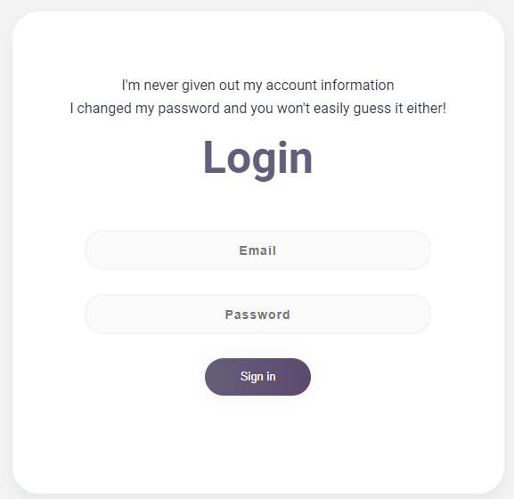
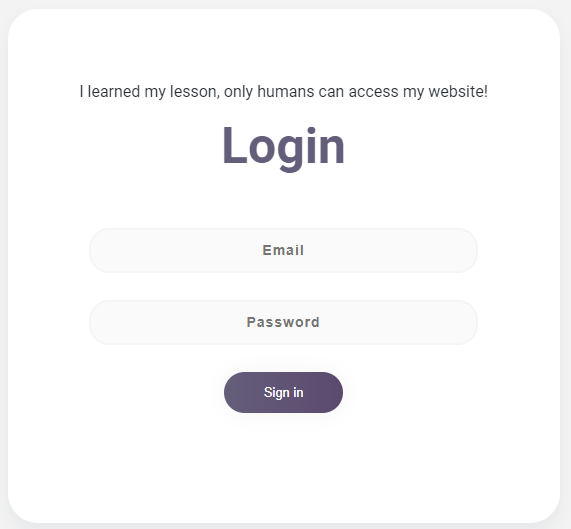
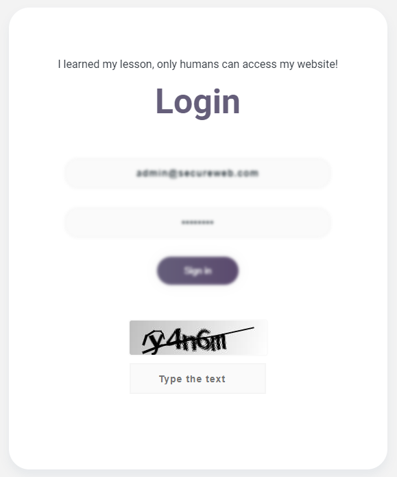
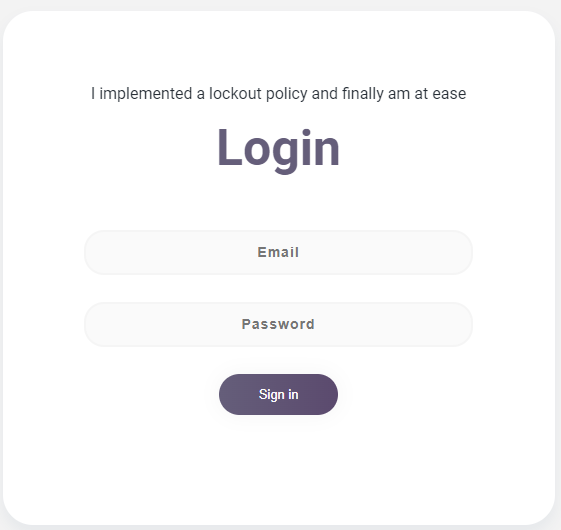

# SecureWeb

A project built using the `Django` framework. It features a demo where users can attack various login forms to understand various
security measures. Additionally, the goal of this project is to 
encourage users to employ industry standards when designing
applications with user authentication.

## Login Forms :
Below is an overview of the basic security behind each login form.

### [Form 1]


- <span  style="color:#655e7a">No security</span>. This login form is meant to be completely vulnerable to <b>password spraying attacks</b>.

### [Form 2]



- In this login form, the approach used in <b><u>form 1</u></b> will not work. This form <span  style="color:#655e7a">rate limits client requests</span>. If the number of requests exceed a certain threshold within a minute, the client will no longer be able to send requests to this login form. To bypass this, one could use <b>proxies</b>.

### [Form 3]





- Basic <span  style="color:#655e7a">captchas</span> were introduced in this login form. Once you make a login attempt, you then must solve a captcha before you get the login success status.
Given that the logic behind how the captcha's are generated in this form, one could <b>create a script</b> to generate and submit them.

### [Form 4]



- This login form focuses on <span  style="color:#655e7a">locking out users</span> after `x amount` of failed tries as opposed to blocking clients. In situations where this is the only security measure, an attacker might purposely <b>lock out as many accounts as possible</b>.


## Utility scripts :
I have provided several `python` scripts that you can try
out to attack each login form. Otherwise, use any tool such as 
[Burp Suite](https://portswigger.net/burp) or [John the Ripper](https://github.com/openwall/john).

1. `attack.py`  : A script that attempts to bypass the security measures in place for each login form.

2. `monitor.py` : A useful script that will continually monitor updates to the login.log file, which shows the login attempts to each login form.

3. `proxies.py` : A script that creates 1500 [Private IP Addresses](https://whatismyipaddress.com/private-ip#private-ip)
which are then used to mimic [rotating proxies](https://nordvpn.com/cybersecurity/glossary/rotating-proxy/#:~:text=A%20rotating%20proxy%20is%20a,to%20track%20or%20block%20users.) in order to bypass rate limiting and IP blocking. Note, only works on <b>Linux</b>. 

## Dependenices :
Execute the following command to install the necessary modules.
Note, `requirements.txt` is located in the <b>src</b> directory.

```
pip install -r requirements.txt
```

## Deployment :
To start the web server, execute run the command:
```properties
python manage.py runserver
```
and then navigate to the [SecureWeb URL](http://localhost:8000/secureweb/) 
