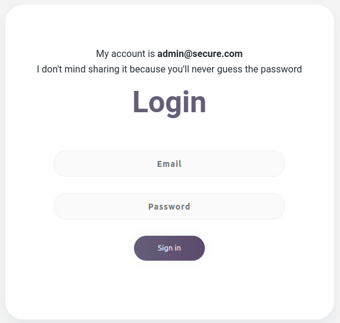

# Password Bruteforcing Demo

An educational project showcasing password bruteforcing techniques and prevention.

<!--  -->


## Dependenices

Have Python3 installed and use pip to install the following:

```
    pip install Flask
    pip install termcolor
```

## Understanding the scripts

Provided below is a general overview of each script file.

### attack.py

`attack.py` is a password bruteforcing script that attempts to bypass the security
implementation for each login form.

### monitor.py

`monitor.py` is a script file that will continually monitor updates to the **login.log** file, which shows the login attempts to each login form.

### proxies.py

`proxies.py` is script that creates numerous [private ips](https://whatismyipaddress.com/private-ip#private-ip) that's used to mimic a proxy pool we'll use to bypass rate limiting and ip blocking.

## Deployment

- To start the server, execute the `server.py` file and navgiate to the [server url](http://127.0.0.1:5000/).

- You can test the security of the login forms via: [Burp Suite](https://portswigger.net/burp), [John the Ripper](https://github.com/openwall/john), or by running the `attack.py` file as explained above.

## SecureWeb

- Project renaming
